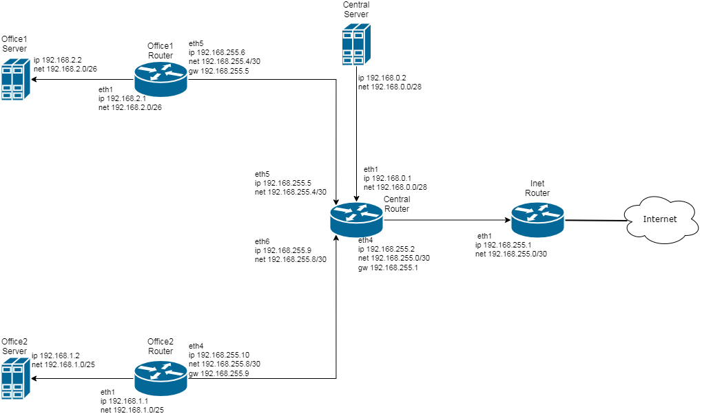

# Network
## Теоретическая часть
[Схема сети](https://www.draw.io/?lightbox=1&highlight=0000ff&edit=_blank&layers=1&nav=1&title=dz-15.drawio#R7Vzfc9o4EP5r8hjGkn8%2FljTpZaZ3l2mmd%2B293AhbgFtjEVsEuL%2F%2BJFsGyxKUULANdR8aayULab%2F9VquV4Ma8m60%2BpGg%2B%2FZ2EOL6BRri6Md%2FfQAgc9h8vr4uyC6xCMEmjUDTZCp6j%2F7AQGkK6iEKcSQ0pITGN5rIwIEmCAyrJUJqSpdxsTGL5U%2BdoghXBc4BiVfp3FNKpkALH31b8hqPJVHy0B92iYoSC75OULBLxeTfQHOf%2FiuoZKvsSE82mKCTLisi8vzHvUkJo8TRb3eGYa7ZUW%2FHew47azbhTnNCDXghc5LijsTcOTWga41tgF128onghlPGYUJwmmIoR03WpJdYVA4QVhmwacy4MYrJgPQ%2BX04ji5zkKuHDJLITJpnQWsxJgj7mCMB%2BCUbxc6IAXAjKLgrKCpuT7BgD%2B4pgk9AHNopjb1V84DVGChFgYEWAqHKpaEIp5xSnFq4pIaOUDJjNM0zVrImohKCEVJmy6QjPLikGUME6rtiBkSNjgZNP3Fgf2IKDQwxKnk08e%2FOdxEdLl0%2FPy22L5x%2FAWeCoCITNbUSQpnZIJSVB8v5XWVL1t85GQuVDqN0zpWqgPLSiRscKriH4Rr%2FPnr%2Fx5YIvS%2B1Wl6v26UnjCacTmjdNSljAdfCk75YVKT7y47Sovraulemc7Ac7IIg1KEtdt2xJeiaJ0gukeTQtFc%2B3utZUUx4hGr7LTODnum7m1gjs4Fe7GIOdmBXq%2Fg9CDtqDfOeSKJ1bsoPS7s9WEL8ODIMoCMmDYM31l4q8Ma4iy6cYsxlEc35GYpHlvpmE6nu9uHG%2BlRqxhdZfM8eQuNWIr50c0wvETySIakYTVjQilZFZp8C6OJryCcgM8dAlozuEDC5qSw3cgN%2Fe6y3c91ePb5rk8vtt7%2FJ%2BjvXsg7d1ueXyjTdzP6PFBB6HvkMd3e4%2FfpscHnt2gx1fgt1W0q6xPSIJlZGMOwHCz4yzREw0zZvn0IeKfL7gVvuNb420LJqnUq0AfCEWV7zVPbzZJeE8l%2FM7t7enYLl59IhEb7Hb7aBjGwDBM34S%2BbVgelAzNAvbAt13fs6FlOTZrIvdfTEF0WbOozRiP9DFe72Oa9DG%2Ba0jQm77RbkypwfsiY4umYsp9McNeV2N1K4tQmm7P%2B0Z47xq19GHbvAd%2Bm7zfcv1rpeaoPYUtMb9Z3nc%2Bi7Rv1G%2BnfobTV059FkomIUrDf6ckozLAcx6k4PT%2Bleky65hXQKIU4KTwXMyDxVHCPrQ8NdprDW9hO7TKnUO5lzBVvlumyncHngn0o%2FeSPegHgg5NObQDHmgX8qND%2Bx7yIyF3yoPutiAvMxgVzP8cj6MAs4kYn4qIrW4DbLI1cGWMRHagCqgQKYqu4zGLwjAPHHQHwHIwcQo4LEveVwNH43Q1R7TwXEe00NoBBxM6Mdf6iOHhTPjTL4eOrQmBm0VHvdtwxwNEFP%2BC6LieHLCYntkyOurytXFldXSe8wXritFRYgu7be74h3u2Xw6d1j1bOZ5DPNvVo%2BNCR%2BaO0TY6au7tMb9Pd%2F0Rmu%2F58irTYIQ2fP68HqUhXgxfPi%2Btp%2FsXZMFbNV4uGRJGrxIKzsuC38LMs4O3WZ7gescaADBfbStLUpWd8MbH94Lp1C57YrMrOpM%2FgInzgcrSDow9mvMqHw6A4w2gnZ%2BkXuZMCmpWp8Ki%2BgfuYt80n5NzOsZjegpGK%2FTVkHw3o22%2Flti21LgRAA2lrXNRWpfp6owxMUqDSyWCRGl%2BuH%2Bh85AJbQyYIT7w3UZPZxYs2bVtoKm7A7MJoRohtC6P2RljYoR22iNCNkfJzhXXrwyg2vDCCMqn4vUr7s4V19KuuFAlqGmfiaBqLqBDxsT%2BohlHIhll82tagTkvLnYmKsWNnuLbbTKoUVxzeqyluOUMzkVyoOaUOmRPjNXWpXJBYTW81JmciNWV%2BehGpwuBjh3xZLnHo%2BqCpm3itHdV%2BYbBOiAa0X0vtnzv9I6q1e9HvuVmWzHO2q2w426ilWeZP7yKVjRs4OqZHhv1yLWZ%2FZAhOdWDiX0JbrZPYOzzR0xLB%2Foj71w2r7tv2RlbuqozhhYzMZ04Y2gzcKpaUR84HZDGMYDsqDRHoaA8um4kzwq6fnJyPTs88BPM7pqnOio326an%2BlFevPdU%2Bz2Vo7lAA0CjnurMGefdxyrXu42AxTbirSHUldo8dGuXxlyNzTd6Cgq7nn%2B92LOIGsMvdh49n3fz2ax9735zo7A9Puu%2Bgd3EGgaudw0Dhc2%2FNaFxpTYP3dovmOnitmZtHvZrWANrGLiWNazns7yG1fisyxidiM%2BsuP3V4byu8sPO5v3%2F)


### Inet
#### Router
gateway 10.0.0.1
|eth#|ip|net|mask|broadcast|hosts|name|
|---|---|---|---|---|---|---|
|eth1|192.168.255.1|192.168.255.0/30|255.255.255.252|192.168.255.3|2|central|
### Central
#### Router
gateway 192.168.255.1
|eth#|ip|net|mask|broadcast|hosts|name|
|---|---|---|---|---|---|---|
|eth1|192.168.0.1|192.168.0.0/28|255.255.255.240|192.168.0.15|14|dir|
|eth2|192.168.0.33|192.168.0.32/28|255.255.255.240|192.168.0.47|14|hw|
|eth3|192.168.0.65|192.168.0.64/26|255.255.255.192|192.168.0.127|62|wifi|
|eth4|192.168.255.2|192.168.255.0/30|255.255.255.252|192.168.255.3|2|inet|
|eth5|192.168.255.5|192.168.255.4/30|255.255.255.252|192.168.255.7|2|office1|
|eth6|192.168.255.9|192.168.255.8/30|255.255.255.252|192.168.255.11|2|office2|
#### Server
gateway 192.168.0.1
|eth#|ip|net|mask|
|---|---|---|---|
|eth1|192.168.0.2|192.168.0.0/28|255.255.255.240|
### Office1
#### Router
gateway 192.168.255.5
|eth#|ip|net|mask|broadcast|hosts|name|
|---|---|---|---|---|---|---|
|eth1|192.168.2.1|192.168.2.0/26|255.255.255.192|192.168.2.63|62|dev|
|eth2|192.168.2.65|192.168.2.64/26|255.255.255.192|192.168.2.127|62|test|
|eth3|192.168.2.129|192.168.2.128/26|255.255.255.192|192.168.2.191|62|managers|
|eth4|192.168.2.193|192.168.2.192/26|255.255.255.192|192.168.2.255|62|hw|
|eth5|192.168.255.6|192.168.255.4/30|255.255.255.252|192.168.255.7|2|central|
#### Server
gateway 192.168.2.1
|eth#|ip|net|mask|
|---|---|---|---|
|eth1|192.168.2.2|192.168.2.0/26|255.255.255.192|
### Office2
gateway 192.168.255.9
|eth#|ip|net|mask|broadcast|hosts|name|
|---|---|---|---|---|---|---|
|eth1|192.168.1.1|192.168.1.0/25|255.255.255.128|192.168.1.127|126|dev|
|eth2|192.168.1.129|192.168.1.128/26|255.255.255.192|192.168.1.191|62|test|
|eth3|192.168.1.193|192.168.1.192/26|255.255.255.192|192.168.1.255|62|hw|
|eth4|192.168.255.10|192.168.255.8/30|255.255.255.252|192.168.255.11|2|central|
#### Server
gateway 192.168.1.1
|eth#|ip|net|mask|
|---|---|---|---|
|eth1|192.168.1.2|192.168.1.0/25|255.255.255.128|
### Свободные подсети
|net|broadcast|hosts|
|---|---|---|
|192.168.0.16/28|192.168.0.31|14|
|192.168.0.48/28|192.168.0.63|14|
|192.168.0.128/25|192.168.0.255|126|

## Практическая часть
Для настроек сетевых адаптеров в Vagrantfile использую адреса интерфейсов из теоретической части
в секции провижн, для всех кроме inetRouter, нужно отключить маршрут по умолчанию через 0 интерфейс
```bash
echo "DEFROUTE=no" >> /etc/sysconfig/network-scripts/ifcfg-eth0
```
включить форвардинг
```bash
sysctl net.ipv4.conf.all.forwarding=1
```
установить приложение traceroute и добавить маршруты к подсетям на хостах
#### inetRouter
```bash
ip route add 192.168.0.0/16 via 192.168.255.2
```
#### centralRouter
```bash
ip route add default via 192.168.255.1
ip route add 192.168.2.0/24 via 192.168.255.6
ip route add 192.168.1.0/24 via 192.168.255.10
```
#### centralServer
```bash
ip route add default via 192.168.0.1
```
#### Office1Router
```bash
ip route add default via 192.168.255.5
```
#### Office1Server
```bash
ip route add default via 192.168.2.1
```
#### Office2Router
```bash
ip route add default via 192.168.255.9
```
#### Office2Server
```bash
ip route add default via 192.168.1.1
```
## Результат
* Сервера видят друг друга
* Доступ во внешнюю сеть идет через inetRouter

Проверка centralServer
```bash
[root@centralServer ~]# traceroute ya.ru
traceroute to ya.ru (87.250.250.242), 30 hops max, 60 byte packets
 1  gateway (192.168.0.1)  0.359 ms  0.244 ms  0.151 ms
 2  192.168.255.1 (192.168.255.1)  0.678 ms  0.551 ms  0.666 ms
 3  * * *
 4  * * *
 5  * * *
 6  c4500x-hq-v19.rinet.net (86.62.124.92)  6.060 ms  3.430 ms  4.015 ms
 7  a7280-m9-v4.rinet.net (86.62.124.193)  1.419 ms  1.335 ms  1.596 ms
 8  dante.yndx.net (195.208.208.93)  1.936 ms  2.070 ms  1.569 ms
 9  ya.ru (87.250.250.242)  8.688 ms  8.525 ms  4.338 ms
```
```bash
[root@centralServer ~]# traceroute 192.168.1.2
traceroute to 192.168.1.2 (192.168.1.2), 30 hops max, 60 byte packets
 1  gateway (192.168.0.1)  0.394 ms  0.231 ms  0.214 ms
 2  192.168.255.10 (192.168.255.10)  0.552 ms  0.436 ms  0.529 ms
 3  192.168.1.2 (192.168.1.2)  0.779 ms  0.689 ms  1.309 ms

[root@centralServer ~]# traceroute 192.168.2.2
traceroute to 192.168.2.2 (192.168.2.2), 30 hops max, 60 byte packets
 1  gateway (192.168.0.1)  0.375 ms  0.262 ms  0.230 ms
 2  192.168.255.6 (192.168.255.6)  0.902 ms  0.812 ms  0.707 ms
 3  192.168.2.2 (192.168.2.2)  0.614 ms  0.523 ms  0.924 ms
```

Проверка Office1Server
```bash
[root@Office1Server ~]# traceroute ya.ru
traceroute to ya.ru (87.250.250.242), 30 hops max, 60 byte packets
 1  gateway (192.168.2.1)  0.310 ms  0.198 ms  0.102 ms
 2  192.168.255.5 (192.168.255.5)  0.564 ms  0.458 ms  0.402 ms
 3  192.168.255.1 (192.168.255.1)  0.694 ms  0.910 ms  0.907 ms
 4  * * *
 5  * * *
 6  * * *
 7  * * *
 8  a7280-m9-v4.rinet.net (86.62.124.193)  2.496 ms  2.352 ms  2.170 ms
 9  dante.yndx.net (195.208.208.93)  2.146 ms  2.025 ms  2.224 ms
10  vla-32z4-eth-trunk1-1.yndx.net (93.158.172.211)  5.233 ms  5.517 ms ya.ru (87.250.250.242)  4.672 ms
```
```bash
[root@Office1Server ~]# traceroute 192.168.0.2
traceroute to 192.168.0.2 (192.168.0.2), 30 hops max, 60 byte packets
 1  gateway (192.168.2.1)  0.342 ms  0.195 ms  0.190 ms
 2  192.168.255.5 (192.168.255.5)  0.561 ms  0.881 ms  0.760 ms
 3  192.168.0.2 (192.168.0.2)  1.217 ms  1.213 ms  1.125 ms

[root@Office1Server ~]# traceroute 192.168.1.2
traceroute to 192.168.1.2 (192.168.1.2), 30 hops max, 60 byte packets
 1  gateway (192.168.2.1)  0.356 ms  0.244 ms  0.153 ms
 2  192.168.255.5 (192.168.255.5)  0.753 ms  0.620 ms  0.637 ms
 3  192.168.255.10 (192.168.255.10)  1.257 ms  1.169 ms  0.885 ms
 4  192.168.1.2 (192.168.1.2)  0.768 ms  0.711 ms  0.923 ms
```
Проверка Office2Server
```bash
[root@Office2Server ~]# traceroute ya.ru
traceroute to ya.ru (87.250.250.242), 30 hops max, 60 byte packets
 1  gateway (192.168.1.1)  0.425 ms  0.263 ms  0.229 ms
 2  192.168.255.9 (192.168.255.9)  0.495 ms  0.423 ms  0.457 ms
 3  192.168.255.1 (192.168.255.1)  1.760 ms  1.394 ms  1.284 ms
 4  * * *
 5  * * *
 6  * * *
 7  * * *
 8  a7280-m9-v4.rinet.net (86.62.124.193)  2.403 ms  1.722 ms  1.656 ms
 9  dante.yndx.net (195.208.208.93)  6.396 ms  5.445 ms  4.741 ms
10  ya.ru (87.250.250.242)  4.561 ms  4.522 ms  7.878 ms
```
```bash
[root@Office2Server ~]# traceroute 192.168.0.2
traceroute to 192.168.0.2 (192.168.0.2), 30 hops max, 60 byte packets
 1  gateway (192.168.1.1)  0.324 ms  0.202 ms  0.194 ms
 2  192.168.255.9 (192.168.255.9)  0.765 ms  0.636 ms  0.541 ms
 3  192.168.0.2 (192.168.0.2)  0.702 ms  0.616 ms  0.612 ms

[root@Office2Server ~]# traceroute 192.168.2.2
traceroute to 192.168.2.2 (192.168.2.2), 30 hops max, 60 byte packets
 1  gateway (192.168.1.1)  0.332 ms  0.172 ms  0.167 ms
 2  192.168.255.9 (192.168.255.9)  0.513 ms  0.498 ms  0.410 ms
 3  192.168.255.6 (192.168.255.6)  1.389 ms  1.807 ms  2.297 ms
 4  192.168.2.2 (192.168.2.2)  2.243 ms  2.131 ms  2.035 ms
```

